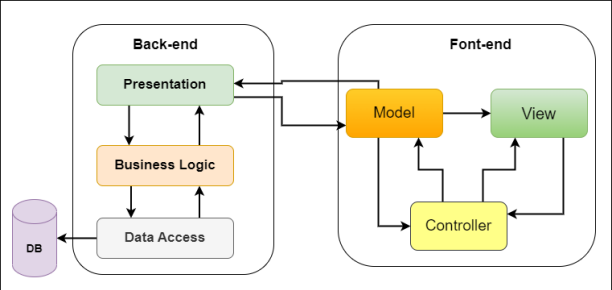
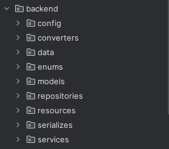
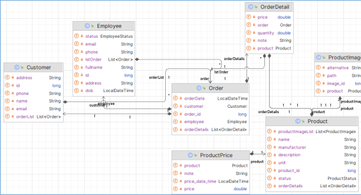
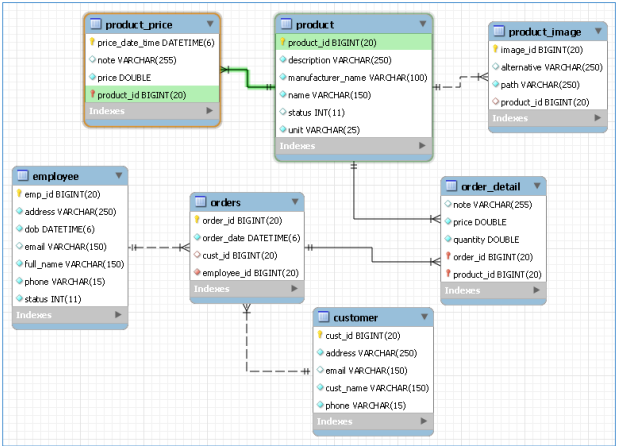

## Information:

Name: Võ Tấn Đạt
ID: 20116031
Subject: Lập trình WWW với công nghệ JAVA

## Description:

Bài tập lab02 week2-3

Yêu cầu: Viết RESTAPI bằng serverlet(JakartaEE) và có frontend

## 1. Kiến trúc dự án

- Mô hình: Client - Server
- Server: 
- 
- Client: 
- 
- Client sử dụng jsp và tailwindcss
## 2. ERD

## 3. Cơ sở dữ liệu

## 4. Chức năng

- Các thao tác CRUD cho các đối tượng, lập order. (dùng JPA).
- Thống kê order theo ngày, theo khoảng thời gian.
- Thống kê order theo nhân viên bán hàng trong 1 khoảng thời gian.
### 4.1 Hiển thị danh sách sản phẩm

### 4.2 Giỏ hàng

### 4.3 Thanh toán

## 5. Cách chạy dự án

- Clone dự án tại link này
- Mở dự án bằng IntelliJ
- Chọn services là Tomcat
- Bấm build để chạy dự án
- Mở trình duyện và xem dự án tại http://localhost:8080

## 6. Các công cụ đã sử dụng

- IDE : IntelliJ
-  Framework: Spring boot
- Web server : Tomcat
- Database server : MySQL
- Container : Docker (sử dụng docker để chạy MySQL)
- Storage code: GitHub

## 7. Lời cảm ơn

Cảm ơn bạn đã ghé thăm dự án của tôi <3
